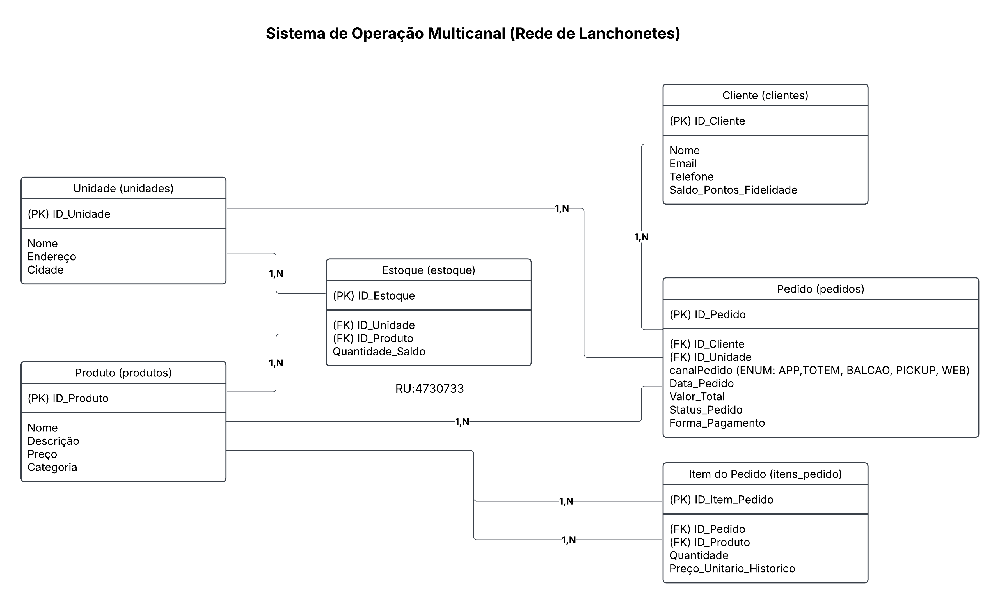
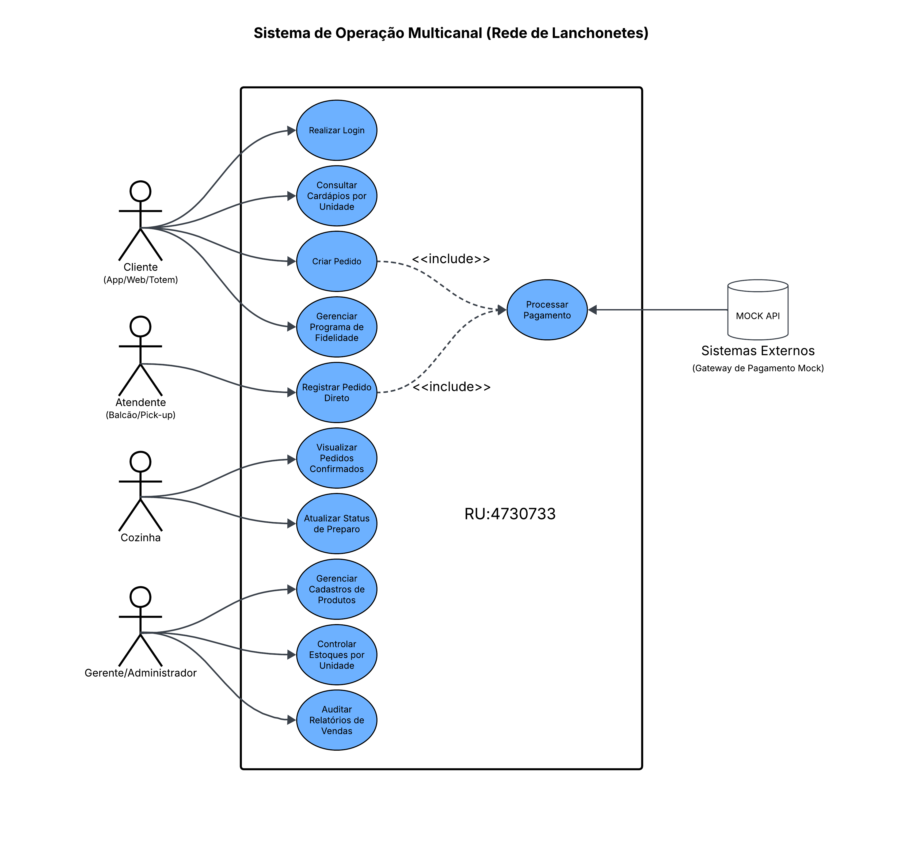
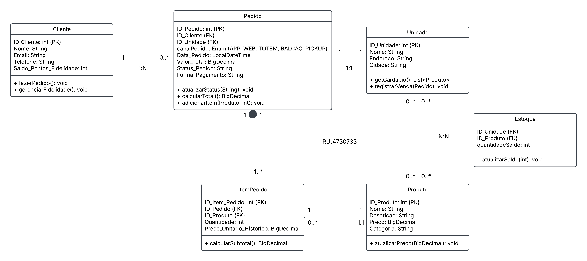
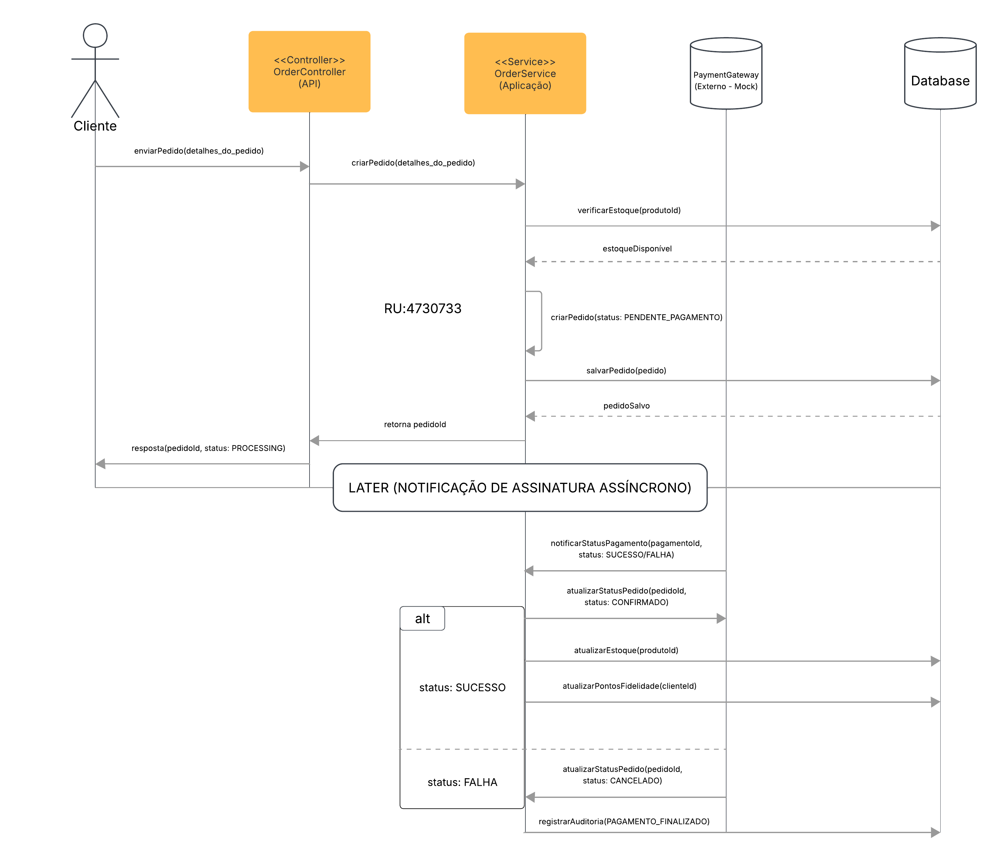

# Raízes do Nordeste

## Requisitos

- **Linguagem:** Java 21
- **Framework:** Spring Boot 4.x
- **Base de Dados:** PostgreSQL
- **Gestor de Dependências:** Maven

## Como Configurar o Banco de Dados

Para rodar o projeto localmente, não é necessário criar arquivos .env extras. 

Basta abrir o arquivo src/main/resources/application.properties e garantir que as configurações do PostgreSQL estejam estruturadas conforme abaixo:
```
spring.application.name=backend
server.port=8080

spring.datasource.url=jdbc:postgresql://localhost:5432/db_raizes_nordeste
spring.datasource.username=postgres
spring.datasource.password=1234

spring.jpa.hibernate.ddl-auto=update
spring.jpa.show-sql=true
spring.jpa.properties.hibernate.dialect=org.hibernate.dialect.PostgreSQLDialect
spring.jpa.defer-datasource-initialization=true
spring.sql.init.mode=always
```
Observação: O banco de dados é povoado automaticamente ao iniciar a aplicação (spring.sql.init.mode=always). 
Os dados necessários para a execução dos testes T01 a T10 são inseridos sem a necessidade de rodar scripts manuais.

## Como Executar o Projeto

### Opção 1 - Usando Docker
Se você possui o Docker e o Docker Compose instalados, esta é a forma mais prática, pois ela sobe o container do banco de dados e da aplicação integrados:

#### 1) Na raiz do projeto, execute o comando:
```
docker-compose up --build
```

#### 2) Para parar os containers, utilize:
```
docker-compose down
```
### Opção 2 - Usando Terminal (Recomendado)

#### 1) Criar a Base de Dados

Certifique-se de que o PostgreSQL está em execução localmente e crie a base de dados:
```
CREATE DATABASE db_raizes_nordeste;
```

#### 2) Instalar Dependências

Execute no terminal
```
./mvnw clean install -DskipTests
```

#### 3) Iniciar a API

Execute no terminal
```
./mvnw spring-boot:run
```
### Opção 3 - Executando pela IDE

1) Abra o projeto em sua IDE
2) Certifique-se de que o seu PostgreSQL está rodando e que as credenciais no arquivo application.properties estão corretas.
3) Navegue até o código-fonte em src/main/java/com.raizesdonordeste.backend/ e localize a classe principal de inicialização (BackendApplication.java).
4) Clique com o botão direito sobre essa classe e selecione Run.

### Erro de Porta

Por padrão, esta aplicação está configurada para rodar na porta 8080.

* Porta Livre: Para que o projeto suba com sucesso, a porta 8080 precisa estar totalmente livre no seu computador.

* O que acontece se a porta estiver ocupada? Se houver outro processo ou uma instância anterior da aplicação rodando em segundo plano, o Spring Boot exibirá um erro informando que o servidor web falhou ao iniciar porque a porta 8080 já está em uso (Port 8080 was already in use).

Como resolver se a porta estiver ocupada?

1) Liberar a porta (Recomendado para avaliações): Identifique e encerre o processo que está travando a porta 8080 no seu sistema operacional antes de iniciar o projeto novamente.
2) Alterar a porta da aplicação: Caso prefira ou precise rodar em outra porta, abra o arquivo de configuração localizado em:
src/main/resources/application.properties e altere a propriedade server.port para uma porta livre (por exemplo, 8081).

## Coleção de Testes Postman (.json)

O arquivo com a coleção de chamadas (raizes-do-nordeste.postman_collection.json) está disponível na pasta docs/postman/. 
Para facilitar a correção e avaliação do projeto, os testes foram organizados de T01 a T10, cobrindo o fluxo principal, regras de negócio e bloqueios de segurança conforme detalhado na documentação.

### Ordem para Execução dos Testes:

```
T01 - Registo de novo cliente no sistema
T02 - Tentativa de login com senha incorreta
T03 - Login com credenciais válidas
T04 - Acesso a recurso protegido sem enviar token
T05 - Tentativa de alteração de estoque com perfil de cliente
T06 - Consulta de cardápio filtrado por unidade
T07 - Criação de pedido com canal e estoque válidos
T08 - Criação de pedido com quantidade superior ao estoque
T09 - Processamento de pagamento simulado aprovado
T10 - Consulta do saldo do programa de fidelidade
```

## Diagramas do Sistema

### Diagrama Entidade Relacionamento


O DER está disponível no repositório. As principais tabelas mapeadas para o banco PostgreSQL incluem:

```
- Unidades
- Produtos
- Estoque
- Pedidos
- Itens do Pedido
- Clientes
```

### Diagrama de Caso de Uso


### Diagrama de Classe


### Diagrama Entidade Relacionamento


## Evidências

URL do Swagger Local: http://localhost:8080/swagger-ui/index.html

Ficheiro da Coleção Postman: \docs\postman\raizes-do-nordeste.postman_collection.json


